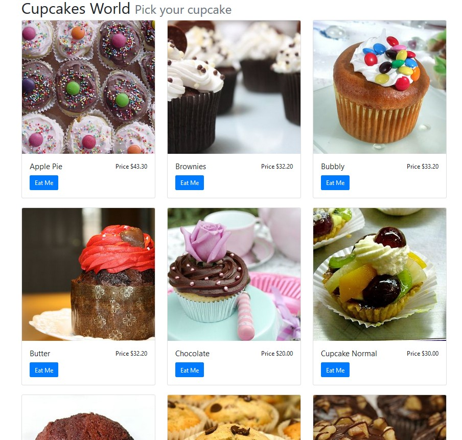

# A basic catalog of products made with PHP



It is a project that shows the creation of a basic catalog of products in an hour. This catalog has the information loaded, so we don't need to add more products.

The list of products could come from a MySql database or using the file system, you could pick one of them.

## Requirements

This project requires PHP 5.6 or higher and Composer (it is a free library)  

### Composer Initialize

Let's open a shell in the same folder of your project and runs the next command.

> composer init


It will create the file called **composer.json**. It will ask for some information.

📝 composer.json

You could later edit this file.


### Installation of Composer

Using the previous shell, let's run the command 

| composer install


It will create the folder

📁 \vendor

And the file composer.lock 

📝 composer.json

### Installing  libraries

And again, using the same shell, let's run the next commands.

> composer require eftec/bladeone  
> composer require eftec/daoone  
> composer require eftec/documentstoreone  


It will download the next three libraries: 

* eftec/bladeone for the templates
* eftec/daoone for the database (if we want to use the database)
* eftec/documentstoreone if we're going to use the filesystem (instead of the database)

They will be stored in the folder:

📁 \vendor


## OK, let's code (Mysql Version)

We have two versions of the same project; one uses MySql while the other relies on the file system.

This first version uses MySql, and we will use the file app.php to access the database.
 
> You must change the database's access according your system (user, password, etc.)

### Application file (app.php)

Here, we will set the autoload (Composer), the database and the bladeone library.

The bladeone library will be used as a template system. It uses the language "blade" (the same than uses Laravel)  

The class DaoOne will connect to the database.


```php
<?php

use eftec\bladeone\BladeOne;
use eftec\DaoOne;

include "vendor/autoload.php";

// we created the new connection to the database :-)
// database located at 127.0.0.1, user root and password: abc.123, schema = cupcakes
$db=new DaoOne("127.0.0.1","root","abc.123","cupcakes");
$db->open();

$blade=new BladeOne(); // it will create the folders compiles/ . The folder views/ must be created
                       // if they are not creating then you should build it manually
```

### Initializing the data createtable.php

For Mysql, we will need to create the table and add some information.
 
> **We must call this page once**. If we execute the page more than once, then it will generate an error (because the table exists).

I create a file called createtable.php that creates the table and add 9 cupcakes to the table.  


```php
<?php

include "app.php";

$sql=<<<TAG
CREATE TABLE `cupcakes` (
  `IdCupcake` INT NOT NULL AUTO_INCREMENT,
  `Name` VARCHAR(45) NULL,
  `Image` VARCHAR(45) NULL,
  `Price` DECIMAL(10,2) NULL,
  `Description` VARCHAR(2000) NULL,
  PRIMARY KEY (`IdCupcake`))
TAG;
$rows=<<<TAG
INSERT INTO `cupcakes`.`cupcakes` (`Name`, `Image`, `Price`, `Description`) VALUES ('Chocolate', 'cupcake1.jpg', '20', 'Chocolate');
INSERT INTO `cupcakes`.`cupcakes` (`Name`, `Image`, `Price`, `Description`) VALUES ('Cupcake Normal', 'cupcake2.jpg', '30', 'Cupcake Normal');
INSERT INTO `cupcakes`.`cupcakes` (`Name`, `Image`, `Price`, `Description`) VALUES ('Gourmet', 'cupcake3.jpg', '35.5', 'Gourmet');
INSERT INTO `cupcakes`.`cupcakes` (`Name`, `Image`, `Price`, `Description`) VALUES ('Apple Pie', 'cupcake4.jpg', '43.3', 'Apple Pie');
INSERT INTO `cupcakes`.`cupcakes` (`Name`, `Image`, `Price`, `Description`) VALUES ('Sprinkles', 'cupcake5.jpg', '24.3', 'Sprinkles');
INSERT INTO `cupcakes`.`cupcakes` (`Name`, `Image`, `Price`, `Description`) VALUES ('Butter', 'cupcake6.jpg', '32.2', 'Butter');
INSERT INTO `cupcakes`.`cupcakes` (`Name`, `Image`, `Price`, `Description`) VALUES ('Lemon', 'cupcake7.jpg', '22.3', 'Lemon');
INSERT INTO `cupcakes`.`cupcakes` (`Name`, `Image`, `Price`, `Description`) VALUES ('Brownies', 'cupcake8.jpg', '32.2', 'Brownies');
INSERT INTO `cupcakes`.`cupcakes` (`Name`, `Image`, `Price`, `Description`) VALUES ('Bubbly', 'cupcake9.jpg', '33.2', 'Bubbly');
TAG;

$db->runRawQuery($sql);

$db->runMultipleRawQuery($rows);
```

> Fatal error: Uncaught Exception: Exception raw CREATE TABLE `cupcakes` ( ... 

Let's say that it fails. It could fail because:

* The table already exists.
* We don't have access to the database (you should edit the file app.php)
* We don't have the permissions to create a table.


### Controller (catalog_mysql.php).

Now, let's show the catalog.  We will do the next operations:

* Read the list of cupcakes from the database.
* Sends the list to the template

```php
<?php
include "app.php";

$cupcakes=$db->select("*")->from("cupcakes")->order("name")->toList();

echo $blade->run("cupcakes.catalog"
    ,['cupcakes'=>$cupcakes,'postfix'=>'mysql']);
```

We are also passing the variable postfix. It is used to create the link to the right version.

### View (views/cupcakes/catalog.blade.php)

Ok, it is a bit long, I started with the startup page of Bootstrap, I added some cards and  the annotation  @foreach cycle

The images exist in the folder:

📁  \img   

This template must exist in the folder:

📁 \views   
..... 📁 \cupcakes   
..... ..... 📝 catalog.blade.php   

Why?, the views folder is the default folder of the view (BladeOne)

The second folder and the file comes from the line:

> echo $blade->run("cupcakes.catalog",...

where **cupcakes** is a folder, and **catalog** is the file (plus extension .blade.php)


```html
<!doctype html>
<html lang="en">
<head>
    <!-- Required meta tags -->
    <meta charset="utf-8">
    <meta name="viewport" content="width=device-width, initial-scale=1, shrink-to-fit=no">
    <!-- Bootstrap CSS -->
    <link rel="stylesheet" href="http://stackpath.bootstrapcdn.com/bootstrap/4.2.1/css/bootstrap.min.css" integrity="sha384-GJzZqFGwb1QTTN6wy59ffF1BuGJpLSa9DkKMp0DgiMDm4iYMj70gZWKYbI706tWS" crossorigin="anonymous">
    <title>Hello, world!</title>
</head>
<body>
<div class="container">
    <h1>Cupcakes World
        <small class="text-muted">Pick your cupcake</small>
    </h1>
    <div class="row">
        @foreach($cupcakes as $cupcake)
        <div class="col-md-4">
            <div class="card">
                <a href="detail_{{$postfix}}.php?id={{$cupcake['IdCupcake']}}">
                    
                </a>
                <div class="card-body">
                    <div class="row">
                        <div class="col-md-7">
                            <h5 class="card-title">{{$cupcake['Name']}}</h5>
                        </div>
                        <div class="col-md-5 text-right">
                            <p class="card-text">Price ${{$cupcake['Price']}}</p>
                        </div>
                    </div>
                    <a href="detail_{{$postfix}}.php?id={{$cupcake['IdCupcake']}}" class="btn btn-primary">Eat Me</a>
                </div>
            </div>
            <br>
        </div>
        
        @endforeach()
          
    </div>
</div>
</body>
</html>
```

The magic is done using the annotation of Blade **@some-operator**

> @foreach($cupcakes as $cupcake)

It generates a loop of the variable $cupcakes. Where $cupcakes comes from?. From here:

> echo $blade->run("cupcakes.catalog",[**'cupcakes'**=>$cupcakes,...]);

Next, we should show each value using the annotation of Blade **{{}}**

> 

## Let's code (Document Version)

It doesn't use Mysql, and it stores the information into the file system (folders and files)

### Application file

Here, we will set the autoload (Composer), the document and the bladeone library.

The bladeone library will be used as a template system. It uses the language "blade" (the same than uses Laravel)  

The class DocumentStoreOne will connect to the filesystem-based database. We set the library, the serialization (we will use json) and the extension.


```php
<?php

use eftec\bladeone\BladeOne;
use eftec\DocumentStoreOne\DocumentStoreOne;

include "vendor/autoload.php";

// folder /db/cupcake
$doc=new DocumentStoreOne("db","cupcake",null, DocumentStoreOne::DSO_FOLDER,false);
$doc->autoSerialize(true,"json_array"); // autoserialize the object using json
$doc->docExt=".json";


$blade=new BladeOne(); // it will create the folders compiles/ . The folder views/ must be created
                       // if they are not created, then you should build it manually
```

### Initializing the data 

We will use the folder as our database.

📁 \db   
..... 📁 \cupcake   
..... ..... 📝 *.json

### Controller (catalog_document.php)

Now, let's show the catalog.  We will do the next operations:

* Read the list of cupcakes from the document repository.
* Sends the list to the template

```php   
include "app_doc.php";
$cupcakes=$doc->get("cupcakes");
echo $blade->run("cupcakes.catalog",['cupcakes'=>$cupcakes,'postfix'=>'document']);
```

And we will use the same views used in the previous exercise.

The line 

> $cupcakes=$doc->get("cupcakes");

It reads from the document base /db/cupcake/ the file cupcakes.json and returns a list of cupcakes.  
This operation could be quite fast since it is only reading from the file system. 
However, it doesn't allow analysis (such as sort, filter, and grouping). If we want something like this, then we must do it manually. 


   
